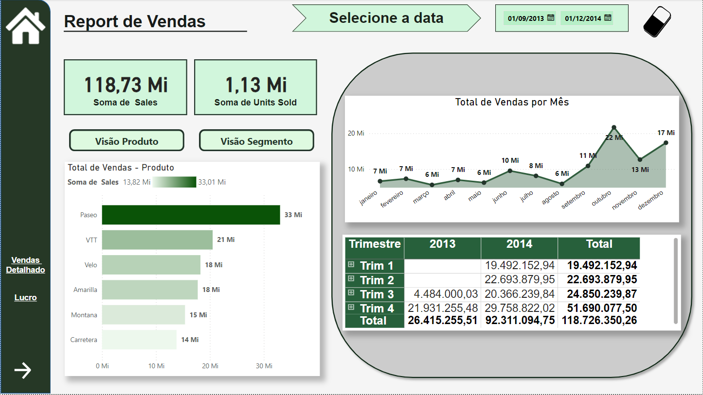
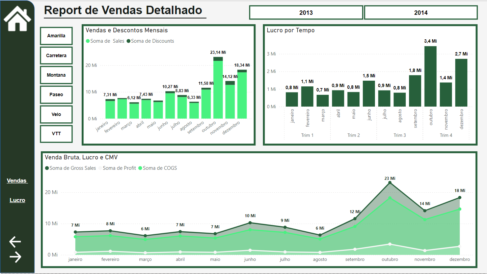
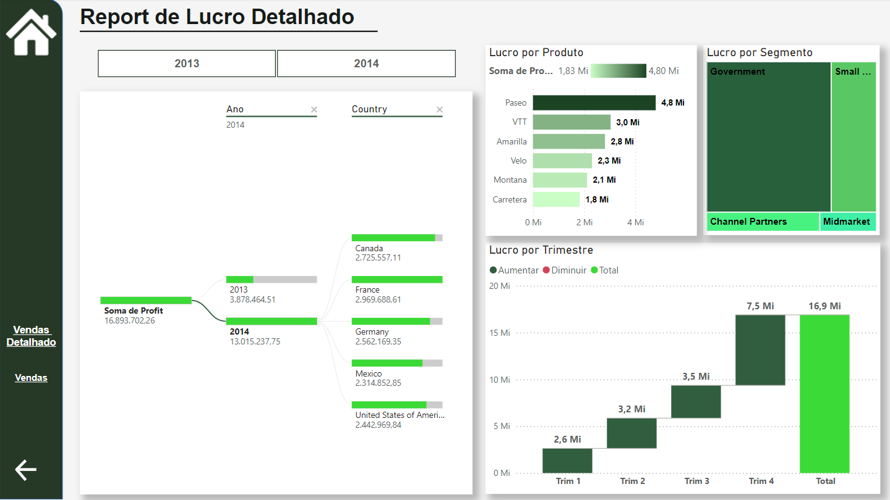

# Projeto Dashboard -  UX :bar_chart:

## NTT DATA - Engenharia de Dados com Python

  

Descrição.

  

### Projeto do Módulo 5 de Power BI -  Experiência do Usuário.

Atualizando Relatório Financeiro com Foco na Experiência do Usuário.

### Navegação

-   **Home Page**: Um botão de retorno à página inicial do relatório.
-   **Próxima Página / Página Anterior**: Botões para navegação sequencial entre as páginas do relatório.
-   **Botões de Visão**: Na primeira página do relatório, há dois botões — "Visão Segmento" e "Visão Produto" — que permitem alternar a visão do gráfico de barras entre as dimensões de Segmento e Produto, proporcionando flexibilidade na análise de dados.
-   **Botões de Navegação Direta**: O relatório também inclui botões para acessar diretamente qualquer outra página, permitindo uma navegação rápida entre as seções.
- **Botões de Segmentação de Dados**: Implementamos botões de segmentação de dados que permitem realizar análises mais detalhadas e interativas. Esses botões facilitam o filtragem de informações específicas, proporcionando uma visualização mais clara e dinâmica dos dados, o que ajuda na identificação de padrões e tendências relevantes.

### Imagens para visualização dos Report
**Report de Vendas**

**Report de Vendas Detalhado**

**Report de Lucro Detalhado**
